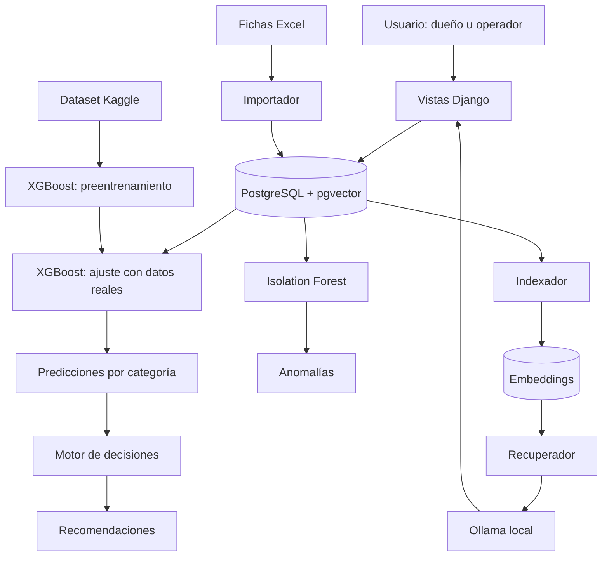

# Sistema de inventario con IA

Sistema web con inteligencia artificial para la gestión de inventario en una
microempresa del sector pintura en Lima. Desarrollado como sistema de tesis
de Ingeniería de Sistemas (diseño preexperimental, pretest/postest sobre el
mismo grupo). Este documento es la referencia técnica del proyecto: describe
la arquitectura, las decisiones de diseño, el modelo de datos y cómo
instalarlo y operarlo.

El sistema cubre: registro de inventario y pedidos, un motor de predicción
de demanda con transferencia de aprendizaje (preentrenamiento con un dataset
externo de Kaggle + ajuste con datos propios de la microempresa), un motor
de decisiones de reposición basado en esas predicciones, detección de
anomalías de control de existencias, y un asistente conversacional (RAG +
LLM local vía Ollama) sobre el estado del inventario.

## Estructura del sistema

```
SISTEMA DE INVENTARIO CON IA
│
├── INTERFAZ — Django Templates
│     ├── Bootstrap 5 + Bootstrap Icons → componentes e iconografía
│     ├── Chart.js → gráficos del dashboard
│     ├── Dashboard → EI, NS y COI con filtro por periodo y origen
│     ├── Operación diaria → pedidos, movimientos, conteos físicos
│     ├── Recomendaciones → reposición explicada, aceptar o rechazar
│     ├── Anomalías → diferencias y movimientos atípicos
│     └── Asistente → chat con fuentes auditables
│
├── BACKEND — Django 5.2 LTS
│     ├── Inventario → productos, stock, movimientos
│     ├── Pedidos → cantidad solicitada vs. atendida
│     ├── Conteos → stock de sistema vs. stock físico
│     ├── Costos → almacenamiento y mermas
│     ├── Indicadores → una sola función por indicador
│     ├── Importación → carga y validación de fichas Excel
│     └── Permisos → grupos administrador y operador
│
├── IA
│     ├── XGBoost → pronóstico de demanda con aprendizaje por transferencia
│     ├── Isolation Forest → detección de anomalías de inventario
│     ├── sentence-transformers → embeddings multilingües locales
│     ├── Ollama + qwen2.5:7b → redacción en lenguaje natural (local)
│     └── RAG → recuperación por similitud sobre datos del sistema
│
├── MOTOR DE DECISIONES (determinístico, no IA)
│     ├── Stock de seguridad
│     ├── Punto de reorden
│     └── Cantidad a pedir
│
└── DATOS
      ├── PostgreSQL 18 → fuente persistente única
      ├── pgvector → búsqueda vectorial para el RAG
      └── Dataset externo → Kaggle Store Item Demand (preentrenamiento)
```

## Decisiones de diseño y su justificación

| Decisión | Alternativa descartada | Razón |
|---|---|---|
| Django Templates | React como proyecto separado | El aporte de la tesis está en la IA; un frontend separado añade semanas sin afectar los indicadores |
| PostgreSQL | MongoDB | Transacciones e integridad referencial garantizan la consistencia del stock, del cual depende el EI |
| Pronóstico por categoría | Pronóstico por producto | Ningún producto superó 4 días con venta al mes; el mínimo viable es 15 |
| Aprendizaje por transferencia | Entrenar solo con datos propios | Un mes de histórico no basta; el modelo sin transferencia apenas iguala a la línea base |
| LLM local (Ollama) | API externa | Confidencialidad de los datos, sin costo y sin dependencia de conexión |
| Motor de decisiones con fórmulas | Decisión por IA | Resultados auditables y respaldados por literatura de gestión de inventario |
| Una función por indicador | Cálculos en cada vista | El dashboard, el importador y el asistente nunca pueden dar valores distintos |

## Arquitectura



### Flujo de operación

1. El operador registra pedidos, movimientos y conteos.
2. El modelo pronostica la demanda de cada categoría apta.
3. El motor de decisiones calcula stock de seguridad, punto de reorden y cantidad a pedir.
4. El detector de anomalías revisa diferencias de inventario y movimientos atípicos.
5. El dashboard presenta los indicadores; el asistente responde consultas sobre los datos.

## Reglas del sistema

Estas reglas son parte del diseño. Cambiarlas altera la validez de los indicadores.

**Integridad del stock.** El stock se actualiza dentro de una transacción con bloqueo del registro. Una salida que deje el stock en negativo se rechaza. Editar o eliminar un movimiento revierte su efecto.

**Demanda real.** El pronóstico se entrena con la cantidad **solicitada**, no con la atendida. Entrenar con lo atendido haría que el modelo aprenda una demanda subestimada y perpetúe el desabastecimiento.

**Separación de orígenes.** Los datos de prueba nunca entran en los indicadores reportados ni en el entrenamiento del modelo vigente. El comando de entrenamiento usa `origen=real` por defecto y registra el origen empleado.

**El modelo de lenguaje no calcula.** Toda cifra que el asistente muestra proviene del contexto recuperado. Si el dato no está en el contexto, el asistente lo indica en lugar de estimarlo. Se verificó que la instrucción por sí sola no basta: lo que evita el cálculo es que el contexto contenga siempre el valor precalculado.

**Falla del servicio de IA.** Si el modelo de lenguaje no responde, el asistente muestra los datos recuperados sin redactar. El sistema no queda inutilizable.

**Anonimización.** Antes de enviar contexto al modelo de lenguaje se eliminan nombres de clientes, razón social, correos y teléfonos. Se mantiene aunque el modelo sea local, para que siga vigente si se cambia a un proveedor externo.

**Validación en la importación.** El importador verifica la coherencia entre las hojas de las fichas, detecta fechas inexistentes y reporta discrepancias antes de escribir. Todo se ejecuta en una transacción: si falla, no queda nada a medias.

## Stack

- Python + Django 5.2
- PostgreSQL con la extensión [pgvector](https://github.com/pgvector/pgvector)
  (necesaria para el índice del asistente conversacional)
- `pandas`, `numpy`, `scikit-learn`, `xgboost` (motor de predicción de demanda)
- `sentence-transformers` (embeddings del asistente conversacional)
- Ollama local (LLM del asistente conversacional; los datos de la
  microempresa no salen del equipo)
- Configuración vía `.env` con `python-decouple`

## Instalación

1. Crear y activar un entorno virtual, e instalar dependencias:

   ```bash
   python -m venv venv
   source venv/bin/activate
   pip install -r requirements.txt
   ```

2. Crear la base de datos en PostgreSQL con la extensión `pgvector`
   disponible en el servidor (`CREATE EXTENSION IF NOT EXISTS vector;` la
   ejecuta la migración `0013`, pero el paquete `pgvector` debe estar
   instalado en el servidor de PostgreSQL).

3. Copiar `.env.example` a `.env` y completar los valores (ver tabla de
   variables más abajo).

4. Aplicar las migraciones y crear los grupos de permisos:

   ```bash
   python manage.py migrate
   python manage.py crear_grupos_permisos
   python manage.py createsuperuser
   ```

5. Levantar el servidor:

   ```bash
   python manage.py runserver
   ```

6. (Opcional, asistente conversacional) Tener Ollama corriendo localmente
   con el modelo indicado en `LLM_MODELO` descargado (`ollama pull
   qwen2.5:7b`), y regenerar el índice con `indexar_conocimiento`.

## Variables de entorno

Definidas en `.env` (plantilla en `.env.example`); nunca se versiona `.env`
ni se ponen credenciales directamente en `core/settings.py`.

| Variable               | Descripción                                                                          | Valor por defecto / ejemplo         |
|------------------------|---------------------------------------------------------------------------------------|--------------------------------------|
| `SECRET_KEY`           | Clave secreta de Django.                                                              | `changeme-generate-a-new-django-secret-key` |
| `DEBUG`                | Modo debug de Django.                                                                 | `True`                               |
| `ALLOWED_HOSTS`        | Hosts permitidos, separados por coma.                                                 | `localhost,127.0.0.1`                |
| `DB_NAME`              | Nombre de la base de datos PostgreSQL.                                                | `inventario_ia`                      |
| `DB_USER`              | Usuario de PostgreSQL.                                                                | `diego`                              |
| `DB_PASSWORD`          | Contraseña de PostgreSQL.                                                             | *(vacío por defecto)*                |
| `DB_HOST`              | Host de PostgreSQL.                                                                   | `localhost`                          |
| `DB_PORT`              | Puerto de PostgreSQL.                                                                 | `5432`                               |
| `LLM_PROVEEDOR`        | Proveedor del modelo de lenguaje del asistente conversacional.                        | `ollama`                             |
| `LLM_MODELO`           | Modelo servido por el proveedor.                                                      | `qwen2.5:7b`                         |
| `LLM_URL`              | URL base de la API del proveedor (sin `/api/chat`).                                   | `http://localhost:11434`             |
| `EMPRESA_RAZON_SOCIAL` | Opcional: si se define, el anonimizador la redacta antes de enviarla al LLM.          | *(vacío)*                            |

## Comandos de gestión

Todos se ejecutan con `python manage.py <comando>`.

| Comando                 | Qué hace                                                                                                          | Parámetros                                                                 |
|--------------------------|---------------------------------------------------------------------------------------------------------------------|-------------------------------------------------------------------------------|
| `cargar_datos`           | Importa las fichas de registro (Excel, hojas `1_EI`, `2_NS`, `3_COI_CA`, `3_COI_PD`) a la base de datos.            | `--archivo` (obligatorio), `--origen prueba\|real` (obligatorio), `--limpiar`, `--dry-run` |
| `clasificar_productos`   | Clasifica productos por categoría según palabras clave en el nombre.                                                | `--codigo`, `--categoria` (ambos opcionales; sin ellos reclasifica todos)     |
| `configurar_lead_time`   | Asigna lead time (días) a productos.                                                                                 | `--dias` (obligatorio), `--codigo` (opcional; sin él, solo los que están en 0) |
| `crear_grupos_permisos`  | Crea/actualiza los grupos "administrador" (acceso total) y "operador" (pedidos, movimientos y conteos, sin borrar). | —                                                                              |
| `detectar_anomalias`     | Corre los detectores de anomalías de control de existencias y guarda registros `Anomalia`.                          | `--origen` (opcional)                                                         |
| `entrenar_base`          | Fase 1: preentrena el motor de predicción con el dataset externo de Kaggle.                                          | `--archivo` (por defecto `datos/train.csv`), `--dias-test` (30)               |
| `entrenar_ajustado`      | Fase 2: continúa el entrenamiento del modelo base con datos internos (transferencia) y compara contra línea base y modelo solo-interno. | `--origen prueba\|real` (por defecto `real`), `--dias-test` (30), `--nivel producto\|categoria` (por defecto `producto`) |
| `predecir_demanda`       | Genera predicciones de demanda diaria con el modelo ajustado activo (o el base si aún no hay ajustado).              | `--dias` (30), `--origen` (opcional)                                          |
| `evaluar_predicciones`   | Completa `demanda_real` en predicciones ya vencidas y calcula MAE, RMSE, SMAPE y R².                                 | —                                                                              |
| `generar_recomendaciones`| Genera una `Recomendacion` de reposición por producto activo con predicciones disponibles.                           | `--nivel-servicio` (0.95), `--dias-cobertura` (30)                            |
| `indexar_conocimiento`   | Regenera el índice del asistente conversacional (borra y reconstruye `DocumentoIndexado`).                           | —                                                                              |
| `recalcular_stock`       | Recalcula `stock_actual` de todos los productos a partir del historial de `Movimiento`.                              | —                                                                              |

## Modelos de datos

Todos en el paquete `inventario/models/` (`operacion.py`, `costos.py`,
`ia.py`), registrados en `admin.py`. El campo
`origen` (`prueba`/`real`) presente en varios modelos permite separar y
limpiar los datos de prueba (pretest/postest) de los datos reales del
negocio.

| Modelo                | Campos principales                                                                                                           |
|------------------------|-------------------------------------------------------------------------------------------------------------------------------|
| `Producto`             | `codigo`, `nombre`, `presentacion`, `color`, `marca`, `categoria`, `precio_venta`, `costo_compra`, `stock_actual`, `stock_minimo`, `lead_time_dias`, `activo`, `origen` |
| `Proveedor`            | `nombre`, `contacto`, `telefono`, `lead_time_promedio`                                                                        |
| `Compra`               | `proveedor` (FK), `fecha_pedido`, `fecha_llegada`, `estado`                                                                   |
| `CompraDetalle`        | `compra` (FK), `producto` (FK), `cantidad_pedida`, `cantidad_recibida`, `costo_unitario`, `fecha_llegada_linea`               |
| `Movimiento`           | `producto` (FK), `tipo` (ingreso/salida/ajuste), `cantidad`, `fecha`, `documento`, `motivo`, `usuario` (FK), `stock_anterior`, `origen` |
| `Pedido`               | `fecha_solicitud`, `cliente`, `canal`, `estado`, `origen`                                                                     |
| `PedidoDetalle`        | `pedido` (FK), `producto` (FK), `cantidad_solicitada`, `cantidad_atendida`, `fecha_requerida`, `fecha_atencion`, `atendido_a_tiempo`, `motivo_no_atencion` |
| `ConteoFisico`         | `fecha_corte`, `responsable`, `observaciones`, `origen`                                                                       |
| `ConteoDetalle`        | `conteo` (FK), `producto` (FK), `stock_sistema`, `stock_fisico`, `diferencia` (calculado)                                     |
| `Merma`                | `producto` (FK), `cantidad`, `motivo`, `costo_unitario`, `fecha`, `origen`                                                    |
| `CostoAlmacenamiento`  | `periodo_mes`, `concepto`, `monto`, `origen`                                                                                  |
| `ModeloEntrenado`      | `fecha_entrenamiento`, `fase` (base/ajustado), `nivel` (producto/categoria), `algoritmo`, `hiperparametros`, `mae`, `rmse`, `smape`, `r2`, `mae_linea_base`, `mae_solo_interno`, `n_registros_externos`, `n_registros_internos`, `origen_datos_internos`, `ruta_archivo`, `activo` |
| `Prediccion`           | `producto` (FK), `fecha_generacion`, `fecha_objetivo`, `demanda_predicha`, `demanda_real`, `modelo` (FK a `ModeloEntrenado`), `nivel_prediccion`, `participacion_usada` |
| `Recomendacion`        | `producto` (FK), `fecha_generacion`, `estado` (crítico/reponer/normal/exceso), `stock_actual_snapshot`, `demanda_predicha_periodo`, `desviacion_demanda`, `lead_time_usado`, `stock_seguridad`, `punto_reorden`, `cantidad_sugerida`, `nivel_servicio_objetivo`, `explicacion`, `aceptada`, `fecha_decision` |
| `Anomalia`             | `producto` (FK), `fecha_deteccion`, `tipo`, `severidad`, `score`, `valor_observado`, `valor_esperado`, `descripcion`, `revisada`, `fecha_revision` |
| `DocumentoIndexado`    | `tipo`, `referencia_id`, `contenido`, `embedding` (vector, 384 dim.), `fecha_indexacion`                                      |
| `ConsultaAsistente`    | `pregunta`, `respuesta`, `documentos_usados` (JSON), `fecha`, `usuario` (FK)                                                  |

Todos los montos monetarios (`precio_venta`, `costo_compra`,
`costo_unitario`, `monto`) son `DecimalField(max_digits=12,
decimal_places=2)`, nunca `FloatField`, para evitar errores de redondeo en
los cálculos de costos.

## Indicadores y trazabilidad con los objetivos de la investigación

| Objetivo específico | Indicador | Fórmula | Tablas que lo sostienen | Módulo |
|---|---|---|---|---|
| OE1 · Control de existencias | EI (exactitud del inventario) | (SRC / TR) × 100 | `Producto`, `Movimiento`, `ConteoFisico`, `ConteoDetalle`, `Anomalia` | Stock automático + detección de anomalías |
| OE2 · Análisis predictivo y atención de pedidos | NS (nivel de servicio) | (PAT / PT) × 100 | `Pedido`, `PedidoDetalle`, `ModeloEntrenado`, `Prediccion` | Pronóstico de demanda |
| OE3 · Automatización y costos | COI (costos operativos de inventario) | CA + PD | `CostoAlmacenamiento`, `PedidoDetalle`, `Recomendacion`, `CompraDetalle` | Motor de decisiones + dashboard |

Donde SRC es stock registrado correctamente, TR total de registros
revisados, PAT pedidos atendidos a tiempo, PT pedidos totales, CA costos de
almacenamiento y PD pérdidas por desabastecimiento.

- **EI** — `ConteoFisico` / `ConteoDetalle` (comparación `stock_sistema` vs
  `stock_fisico`; `diferencia = 0` ⇒ registro correcto).
- **NS** — `Pedido` / `PedidoDetalle.atendido_a_tiempo`.
- **COI** — suma de `CostoAlmacenamiento.monto` en el periodo (costos de
  almacenamiento) más, por cada `PedidoDetalle` no atendido por completo,
  `(cantidad no atendida) × (precio_venta − costo_compra)` del producto
  (pérdidas por desabastecimiento). `Merma` registra pérdidas por deterioro,
  vencimiento u obsolescencia pero **no** se suma todavía al cálculo de COI
  (ver corrección más abajo).

## Limitaciones

- El histórico disponible es de 31 días; la literatura recomienda al menos 90 para series temporales.
- El conjunto de prueba abarca 30 días, por lo que las métricas varían entre entrenamientos sucesivos.
- El pronóstico por categoría no captura diferencias finas entre productos de una misma categoría.
- Tres categorías quedan fuera del modelo por volumen insuficiente.
- El detector de movimientos atípicos requiere al menos cinco movimientos previos por producto.
- El modelo de lenguaje local puede producir redacciones imperfectas; las cifras siempre provienen del sistema.
