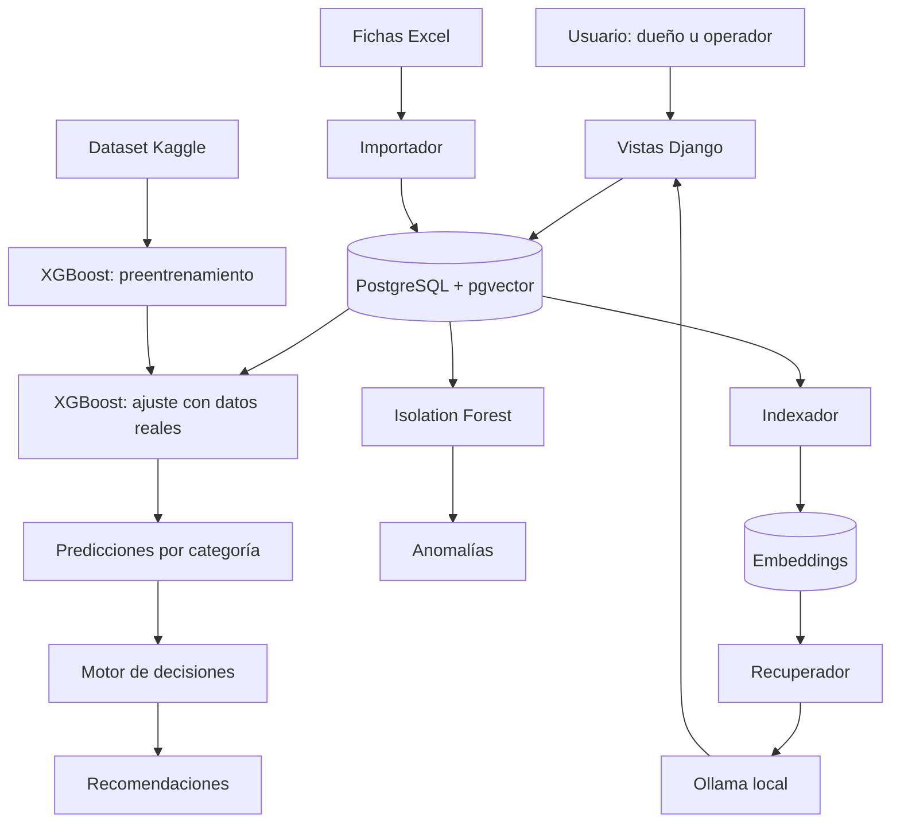

# Sistema de inventario con IA

Sistema web con inteligencia artificial para la gestión de inventario en una
microempresa del sector pintura en Lima. Desarrollado como sistema de tesis
de Ingeniería de Sistemas (diseño preexperimental, pretest/postest sobre el
mismo grupo). Este documento es la referencia técnica del proyecto: describe
la arquitectura, las decisiones de diseño, el modelo de datos y cómo
instalarlo y operarlo.

El sistema cubre: registro de inventario y pedidos, un motor de predicción
de demanda con transferencia de aprendizaje (preentrenamiento con un dataset
externo de Kaggle + ajuste con datos propios de la microempresa), un motor
de decisiones de reposición basado en esas predicciones, detección de
anomalías de control de existencias, y un asistente conversacional (RAG +
LLM local vía Ollama) sobre el estado del inventario.

## Estructura del sistema

```
SISTEMA DE INVENTARIO CON IA
│
├── INTERFAZ — Django Templates
│     ├── Bootstrap 5 + Bootstrap Icons → componentes e iconografía
│     ├── Chart.js → gráficos del dashboard
│     ├── Dashboard → EI, NS y COI con filtro por periodo y origen
│     ├── Operación diaria → pedidos, movimientos, conteos físicos
│     ├── Recomendaciones → reposición explicada, aceptar o rechazar
│     ├── Anomalías → diferencias y movimientos atípicos
│     └── Asistente → chat con fuentes auditables
│
├── BACKEND — Django 5.2 LTS
│     ├── Inventario → productos, stock, movimientos
│     ├── Pedidos → cantidad solicitada vs. atendida
│     ├── Conteos → stock de sistema vs. stock físico
│     ├── Costos → almacenamiento y mermas
│     ├── Indicadores → una sola función por indicador
│     ├── Importación → carga y validación de fichas Excel
│     └── Permisos → grupos administrador y operador
│
├── IA
│     ├── XGBoost → pronóstico de demanda con aprendizaje por transferencia
│     ├── Isolation Forest → detección de anomalías de inventario
│     ├── sentence-transformers → embeddings multilingües locales
│     ├── Ollama + qwen2.5:7b → redacción en lenguaje natural (local)
│     └── RAG → recuperación por similitud sobre datos del sistema
│
├── MOTOR DE DECISIONES (determinístico, no IA)
│     ├── Stock de seguridad
│     ├── Punto de reorden
│     └── Cantidad a pedir
│
└── DATOS
      ├── PostgreSQL 18 → fuente persistente única
      ├── pgvector → búsqueda vectorial para el RAG
      └── Dataset externo → Kaggle Store Item Demand (preentrenamiento)
```

## Decisiones de diseño y su justificación

| Decisión | Alternativa descartada | Razón |
|---|---|---|
| Django Templates | React como proyecto separado | El aporte de la tesis está en la IA; un frontend separado añade semanas sin afectar los indicadores |
| PostgreSQL | MongoDB | Transacciones e integridad referencial garantizan la consistencia del stock, del cual depende el EI |
| Pronóstico por categoría | Pronóstico por producto | Ningún producto superó 4 días con venta al mes; el mínimo viable es 15 |
| Aprendizaje por transferencia | Entrenar solo con datos propios | Un mes de histórico no basta; el modelo sin transferencia apenas iguala a la línea base |
| LLM local (Ollama) | API externa | Confidencialidad de los datos, sin costo y sin dependencia de conexión |
| Motor de decisiones con fórmulas | Decisión por IA | Resultados auditables y respaldados por literatura de gestión de inventario |
| Una función por indicador | Cálculos en cada vista | El dashboard, el importador y el asistente nunca pueden dar valores distintos |

## Arquitectura


```mermaid
flowchart TD
  U[Usuario: dueño u operador] --> V[Vistas Django]
  V --> BD[(PostgreSQL + pgvector)]
  X[Fichas Excel] --> IMP[Importador]
  IMP --> BD
  K[Dataset Kaggle] --> ML[XGBoost: preentrenamiento]
  BD --> ML2[XGBoost: ajuste con datos reales]
  ML --> ML2
  ML2 --> P[Predicciones por categoría]
  P --> DES[Motor de decisiones]
  DES --> REC[Recomendaciones]
  BD --> AN[Isolation Forest]
  AN --> ANO[Anomalías]
  BD --> IDX[Indexador]
  IDX --> VEC[(Embeddings)]
  VEC --> RAG[Recuperador]
  RAG --> LLM[Ollama local]
  LLM --> V
```

### Flujo de operación

1. El operador registra pedidos, movimientos y conteos.
2. El modelo pronostica la demanda de cada categoría apta.
3. El motor de decisiones calcula stock de seguridad, punto de reorden y cantidad a pedir.
4. El detector de anomalías revisa diferencias de inventario y movimientos atípicos.
5. El dashboard presenta los indicadores; el asistente responde consultas sobre los datos.

## Reglas del sistema

Estas reglas son parte del diseño. Cambiarlas altera la validez de los indicadores.

**Integridad del stock.** El stock se actualiza dentro de una transacción con bloqueo del registro. Una salida que deje el stock en negativo se rechaza. Editar o eliminar un movimiento revierte su efecto.

**Demanda real.** El pronóstico se entrena con la cantidad **solicitada**, no con la atendida. Entrenar con lo atendido haría que el modelo aprenda una demanda subestimada y perpetúe el desabastecimiento.

**Separación de orígenes.** Los datos de prueba nunca entran en los indicadores reportados ni en el entrenamiento del modelo vigente. El comando de entrenamiento usa `origen=real` por defecto y registra el origen empleado.

**El modelo de lenguaje no calcula.** Toda cifra que el asistente muestra proviene del contexto recuperado. Si el dato no está en el contexto, el asistente lo indica en lugar de estimarlo. Se verificó que la instrucción por sí sola no basta: lo que evita el cálculo es que el contexto contenga siempre el valor precalculado.

**Falla del servicio de IA.** Si el modelo de lenguaje no responde, el asistente muestra los datos recuperados sin redactar. El sistema no queda inutilizable.

**Anonimización.** Antes de enviar contexto al modelo de lenguaje se eliminan nombres de clientes, razón social, correos y teléfonos. Se mantiene aunque el modelo sea local, para que siga vigente si se cambia a un proveedor externo.

**Validación en la importación.** El importador verifica la coherencia entre las hojas de las fichas, detecta fechas inexistentes y reporta discrepancias antes de escribir. Todo se ejecuta en una transacción: si falla, no queda nada a medias.

## Stack

- Python + Django 5.2
- PostgreSQL con la extensión [pgvector](https://github.com/pgvector/pgvector)
  (necesaria para el índice del asistente conversacional)
- `pandas`, `numpy`, `scikit-learn`, `xgboost` (motor de predicción de demanda)
- `sentence-transformers` (embeddings del asistente conversacional)
- Ollama local (LLM del asistente conversacional; los datos de la
  microempresa no salen del equipo)
- Configuración vía `.env` con `python-decouple`

## Instalación

1. Crear y activar un entorno virtual, e instalar dependencias:

   ```bash
   python -m venv venv
   source venv/bin/activate
   pip install -r requirements.txt
   ```

2. Crear la base de datos en PostgreSQL con la extensión `pgvector`
   disponible en el servidor (`CREATE EXTENSION IF NOT EXISTS vector;` la
   ejecuta la migración `0013`, pero el paquete `pgvector` debe estar
   instalado en el servidor de PostgreSQL).

3. Copiar `.env.example` a `.env` y completar los valores (ver tabla de
   variables más abajo).

4. Aplicar las migraciones y crear los grupos de permisos:

   ```bash
   python manage.py migrate
   python manage.py crear_grupos_permisos
   python manage.py createsuperuser
   ```

5. Levantar el servidor:

   ```bash
   python manage.py runserver
   ```

6. (Opcional, asistente conversacional) Tener Ollama corriendo localmente
   con el modelo indicado en `LLM_MODELO` descargado (`ollama pull
   qwen2.5:7b`), y regenerar el índice con `indexar_conocimiento`.

## Variables de entorno

Definidas en `.env` (plantilla en `.env.example`); nunca se versiona `.env`
ni se ponen credenciales directamente en `core/settings.py`.

| Variable               | Descripción                                                                          | Valor por defecto / ejemplo         |
|------------------------|---------------------------------------------------------------------------------------|--------------------------------------|
| `SECRET_KEY`           | Clave secreta de Django.                                                              | `changeme-generate-a-new-django-secret-key` |
| `DEBUG`                | Modo debug de Django.                                                                 | `True`                               |
| `ALLOWED_HOSTS`        | Hosts permitidos, separados por coma.                                                 | `localhost,127.0.0.1`                |
| `DB_NAME`              | Nombre de la base de datos PostgreSQL.                                                | `inventario_ia`                      |
| `DB_USER`              | Usuario de PostgreSQL.                                                                | `diego`                              |
| `DB_PASSWORD`          | Contraseña de PostgreSQL.                                                             | *(vacío por defecto)*                |
| `DB_HOST`              | Host de PostgreSQL.                                                                   | `localhost`                          |
| `DB_PORT`              | Puerto de PostgreSQL.                                                                 | `5432`                               |
| `LLM_PROVEEDOR`        | Proveedor del modelo de lenguaje del asistente conversacional.                        | `ollama`                             |
| `LLM_MODELO`           | Modelo servido por el proveedor.                                                      | `qwen2.5:7b`                         |
| `LLM_URL`              | URL base de la API del proveedor (sin `/api/chat`).                                   | `http://localhost:11434`             |
| `EMPRESA_RAZON_SOCIAL` | Opcional: si se define, el anonimizador la redacta antes de enviarla al LLM.          | *(vacío)*                            |

## Comandos de gestión

Todos se ejecutan con `python manage.py <comando>`.

| Comando                 | Qué hace                                                                                                          | Parámetros                                                                 |
|--------------------------|---------------------------------------------------------------------------------------------------------------------|-------------------------------------------------------------------------------|
| `cargar_datos`           | Importa las fichas de registro (Excel, hojas `1_EI`, `2_NS`, `3_COI_CA`, `3_COI_PD`) a la base de datos.            | `--archivo` (obligatorio), `--origen prueba\|real` (obligatorio), `--limpiar`, `--dry-run` |
| `clasificar_productos`   | Clasifica productos por categoría según palabras clave en el nombre.                                                | `--codigo`, `--categoria` (ambos opcionales; sin ellos reclasifica todos)     |
| `configurar_lead_time`   | Asigna lead time (días) a productos.                                                                                 | `--dias` (obligatorio), `--codigo` (opcional; sin él, solo los que están en 0) |
| `crear_grupos_permisos`  | Crea/actualiza los grupos "administrador" (acceso total) y "operador" (pedidos, movimientos y conteos, sin borrar). | —                                                                              |
| `detectar_anomalias`     | Corre los detectores de anomalías de control de existencias y guarda registros `Anomalia`.                          | `--origen` (opcional)                                                         |
| `entrenar_base`          | Fase 1: preentrena el motor de predicción con el dataset externo de Kaggle.                                          | `--archivo` (por defecto `datos/train.csv`), `--dias-test` (30)               |
| `entrenar_ajustado`      | Fase 2: continúa el entrenamiento del modelo base con datos internos (transferencia) y compara contra línea base y modelo solo-interno. Falla si `--dias-test` dejaría menos de 14 días para entrenar. | `--origen prueba\|real` (por defecto `real`), `--dias-test` (30), `--nivel producto\|categoria` (por defecto `producto`) |
| `optimizar_modelo`       | Busca hiperparámetros del ajuste con validación cruzada temporal, prueba variantes de la fase base y de variables, y compara todo sobre el mismo test. **No activa ni registra ningún modelo**; guarda el reporte en `artefactos/optimizacion/` (JSON y CSV). Ver [Optimización del modelo de predicción](#optimización-del-modelo-de-predicción). | `--origen` (`real`), `--nivel` (`categoria`), `--dias-test` (7), `--pliegues` (4), `--iteraciones` (100), `--quitar` (3), `--semilla` (42), `--semillas-ruido` (10), `--archivo-externo` |
| `predecir_demanda`       | Genera predicciones de demanda diaria con el modelo ajustado activo (o el base si aún no hay ajustado).              | `--dias` (30), `--origen` (opcional)                                          |
| `evaluar_predicciones`   | Completa `demanda_real` en predicciones ya vencidas y calcula MAE, RMSE, SMAPE y R².                                 | —                                                                              |
| `generar_recomendaciones`| Genera una `Recomendacion` de reposición por producto activo con predicciones disponibles.                           | `--nivel-servicio` (0.95), `--dias-cobertura` (30)                            |
| `indexar_conocimiento`   | Regenera el índice del asistente conversacional (borra y reconstruye `DocumentoIndexado`).                           | —                                                                              |
| `recalcular_stock`       | Recalcula `stock_actual` de todos los productos a partir del historial de `Movimiento`.                              | —                                                                              |

## Modelos de datos

Todos en el paquete `inventario/models/` (`operacion.py`, `costos.py`,
`ia.py`), registrados en `admin.py`. El campo
`origen` (`prueba`/`real`) presente en varios modelos permite separar y
limpiar los datos de prueba (pretest/postest) de los datos reales del
negocio.

| Modelo                | Campos principales                                                                                                           |
|------------------------|-------------------------------------------------------------------------------------------------------------------------------|
| `Producto`             | `codigo`, `nombre`, `presentacion`, `color`, `marca`, `categoria`, `precio_venta`, `costo_compra`, `stock_actual`, `stock_minimo`, `lead_time_dias`, `activo`, `origen` |
| `Proveedor`            | `nombre`, `contacto`, `telefono`, `lead_time_promedio`                                                                        |
| `Compra`               | `proveedor` (FK), `fecha_pedido`, `fecha_llegada`, `estado`                                                                   |
| `CompraDetalle`        | `compra` (FK), `producto` (FK), `cantidad_pedida`, `cantidad_recibida`, `costo_unitario`, `fecha_llegada_linea`               |
| `Movimiento`           | `producto` (FK), `tipo` (ingreso/salida/ajuste), `cantidad`, `fecha`, `documento`, `motivo`, `usuario` (FK), `stock_anterior`, `origen` |
| `Pedido`               | `fecha_solicitud`, `cliente`, `canal`, `estado`, `origen`                                                                     |
| `PedidoDetalle`        | `pedido` (FK), `producto` (FK), `cantidad_solicitada`, `cantidad_atendida`, `fecha_requerida`, `fecha_atencion`, `atendido_a_tiempo`, `motivo_no_atencion` |
| `ConteoFisico`         | `fecha_corte`, `responsable`, `observaciones`, `origen`                                                                       |
| `ConteoDetalle`        | `conteo` (FK), `producto` (FK), `stock_sistema`, `stock_fisico`, `diferencia` (calculado)                                     |
| `Merma`                | `producto` (FK), `cantidad`, `motivo`, `costo_unitario`, `fecha`, `origen`                                                    |
| `CostoAlmacenamiento`  | `periodo_mes`, `concepto`, `monto`, `origen`                                                                                  |
| `ModeloEntrenado`      | `fecha_entrenamiento`, `fase` (base/ajustado), `nivel` (producto/categoria), `algoritmo`, `hiperparametros`, `mae`, `rmse`, `smape`, `r2`, `mae_linea_base`, `mae_solo_interno`, `n_registros_externos`, `n_registros_internos`, `origen_datos_internos`, `dias_entrenamiento`, `dias_prueba`, `ruta_archivo`, `activo` |
| `Prediccion`           | `producto` (FK), `fecha_generacion`, `fecha_objetivo`, `demanda_predicha`, `demanda_real`, `modelo` (FK a `ModeloEntrenado`), `nivel_prediccion`, `participacion_usada` |
| `Recomendacion`        | `producto` (FK), `fecha_generacion`, `estado` (crítico/reponer/normal/exceso), `stock_actual_snapshot`, `demanda_predicha_periodo`, `desviacion_demanda`, `lead_time_usado`, `stock_seguridad`, `punto_reorden`, `cantidad_sugerida`, `nivel_servicio_objetivo`, `explicacion`, `aceptada`, `fecha_decision` |
| `Anomalia`             | `producto` (FK), `fecha_deteccion`, `tipo`, `severidad`, `score`, `valor_observado`, `valor_esperado`, `descripcion`, `revisada`, `fecha_revision` |
| `DocumentoIndexado`    | `tipo`, `referencia_id`, `contenido`, `embedding` (vector, 384 dim.), `fecha_indexacion`                                      |
| `ConsultaAsistente`    | `pregunta`, `respuesta`, `documentos_usados` (JSON), `fecha`, `usuario` (FK)                                                  |

Todos los montos monetarios (`precio_venta`, `costo_compra`,
`costo_unitario`, `monto`) son `DecimalField(max_digits=12,
decimal_places=2)`, nunca `FloatField`, para evitar errores de redondeo en
los cálculos de costos.

## Indicadores y trazabilidad con los objetivos de la investigación

| Objetivo específico | Indicador | Fórmula | Tablas que lo sostienen | Módulo |
|---|---|---|---|---|
| OE1 · Control de existencias | EI (exactitud del inventario) | (SRC / TR) × 100 | `Producto`, `Movimiento`, `ConteoFisico`, `ConteoDetalle`, `Anomalia` | Stock automático + detección de anomalías |
| OE2 · Análisis predictivo y atención de pedidos | NS (nivel de servicio) | (PAT / PT) × 100 | `Pedido`, `PedidoDetalle`, `ModeloEntrenado`, `Prediccion` | Pronóstico de demanda |
| OE3 · Automatización y costos | COI (costos operativos de inventario) | CA + PD | `CostoAlmacenamiento`, `PedidoDetalle`, `Recomendacion`, `CompraDetalle` | Motor de decisiones + dashboard |

Donde SRC es stock registrado correctamente, TR total de registros
revisados, PAT pedidos atendidos a tiempo, PT pedidos totales, CA costos de
almacenamiento y PD pérdidas por desabastecimiento.

- **EI** — `ConteoFisico` / `ConteoDetalle` (comparación `stock_sistema` vs
  `stock_fisico`; `diferencia = 0` ⇒ registro correcto).
- **NS** — `Pedido` / `PedidoDetalle.atendido_a_tiempo`.
- **COI** — suma de `CostoAlmacenamiento.monto` en el periodo (costos de
  almacenamiento) más, por cada `PedidoDetalle` no atendido por completo,
  `(cantidad no atendida) × (precio_venta − costo_compra)` del producto
  (pérdidas por desabastecimiento).

  **Las mermas ya están dentro de esa suma**: `cargar_datos` (hoja
  `3_COI_CA`) carga el monto agregado de "Mermas del periodo" como una fila
  más de `CostoAlmacenamiento` (concepto `"Mermas del periodo — ..."`), no
  como registros `Merma` uno por uno — el Excel de esa hoja no trae el
  desglose por producto/cantidad que el modelo `Merma` exige. El modelo
  `Merma` existe para si en el futuro se quiere registrar cada merma
  individualmente (producto, cantidad, motivo, fecha), pero **si
  `calcular_coi()` llegara a sumar también `Merma.cantidad × costo_unitario`
  al COI, el monto de mermas quedaría contado dos veces**: una vez como fila
  agregada de `CostoAlmacenamiento` y otra vez desglosada por `Merma`. Antes
  de instrumentar `Merma` en el cálculo, hay que dejar de cargar "Mermas del
  periodo" como fila de `CostoAlmacenamiento` (o restarla al construir el
  monto de almacenamiento), no simplemente sumar las dos fuentes.

## Optimización del modelo de predicción

Comando `optimizar_modelo` (`inventario/ml/optimizacion.py`). Se corrió el
01/10/2026 sobre los datos reales de agosto 2026, nivel categoría
(accesorio, esmalte, látex), con la misma división que el modelo vigente
(#5): **24 días de ajuste (01/08–24/08) y 7 de prueba (25/08–31/08)**, en
orden cronológico. Se puede repetir tal cual cuando haya más histórico
(`python manage.py optimizar_modelo`, ~2 minutos).

### Qué se probó

1. **Hiperparámetros de la fase de ajuste** — búsqueda aleatoria de 100
   candidatos (`ParameterSampler`, equivalente a `RandomizedSearchCV`) más la
   configuración actual, sobre `n_estimators`, `learning_rate`,
   `max_depth`, `min_child_weight`, `subsample`, `colsample_bytree` y
   `reg_lambda` (espacio en `ESPACIO_AJUSTE`). Se eligió por validación
   cruzada temporal (`TimeSeriesSplit`, 4 pliegues) **solo sobre los 24 días
   de ajuste**: pliegues que entrenan con 8, 12, 16 y 20 días y validan con
   los 4 días siguientes. Los pliegues se arman por fecha, no por fila, para
   que las tres categorías de un mismo día caigan siempre juntas.
2. **Fase base** — 8 combinaciones adicionales de árboles (150, 300, 600) y
   learning rate (0.02, 0.05, 0.1) en el preentrenamiento con Kaggle, cada
   una ajustada con los hiperparámetros de ajuste actuales.
3. **Variables**, cada alternativa por separado: (a) + rezago de 1 día y
   media móvil de 3 días; (b) + indicador de inicio y de fin de mes (5
   primeros / 5 últimos días); (c) − las 3 variables de menor importancia
   por ganancia en el modelo ajustado actual (`dia_mes`, `rezago_30`,
   `std_movil_30`). Como las variables deben ser idénticas entre
   preentrenamiento y ajuste, **cada variante reentrena también la fase
   base** con ese mismo conjunto.
4. **Combinada** — la mejor base y el mejor conjunto de variables *según la
   validación cruzada* (nunca según el test), con su propia búsqueda del
   ajuste.

Garantías de validez: el test no participa de ninguna elección (ni de la
búsqueda, ni de la elección de base/variables, ni del cálculo de
importancias); un test automatizado altera por completo la demanda de los
días de prueba y verifica que nada de lo elegido cambie
(`inventario/tests/test_optimizacion.py`). No se usa shuffle en ningún paso.

Columnas de la tabla: **R² CV** = R² fuera de pliegue de la validación
cruzada (días de ajuste); **MAE/RMSE/SMAPE/R²** = test a un paso (las
variables de cada día usan la demanda real de días anteriores, igual que
`entrenar_ajustado`); **R² rec.** = test pronosticado de forma recursiva
desde el 24/08, sin ver ninguna demanda real del periodo de prueba (así usa
el modelo `predecir_demanda`).

### Resultados (mismo test de 21 filas, ordenados por R²)

| # | Grupo | Configuración | R² CV | MAE | RMSE | SMAPE | R² | R² rec. |
|---|---|---|---:|---:|---:|---:|---:|---:|
| 1 | 2. Base | Base 300 árboles, lr 0.02 | 0.256 | 11.79 | 13.64 | 61.7% | **0.4258** | 0.4504 |
| 2 | 2. Base | Base 150 árboles, lr 0.05 | 0.256 | 12.04 | 13.72 | 62.1% | 0.4193 | 0.4440 |
| 3 | Referencia | Modelo base sin ajuste | 0.224 | 11.82 | 13.74 | 61.1% | 0.4175 | 0.4157 |
| 4 | 2. Base | Base 150 árboles, lr 0.1 | 0.246 | 12.00 | 13.77 | 62.2% | 0.4151 | 0.4482 |
| 5 | Referencia | **Configuración actual (vigente, #5)** | 0.255 | 11.89 | 13.93 | 61.0% | **0.4013** | 0.4542 |
| 6 | 2. Base | Base 150 árboles, lr 0.02 | 0.248 | 12.39 | 14.00 | 62.6% | 0.3950 | 0.4225 |
| 7 | 3. Variables | + inicio y fin de mes | 0.219 | 12.18 | 14.10 | 62.0% | 0.3865 | 0.4161 |
| 8 | 2. Base | Base 600 árboles, lr 0.05 | 0.255 | 11.97 | 14.11 | 60.6% | 0.3860 | 0.4321 |
| 9 | 3. Variables | − dia_mes, rezago_30, std_movil_30 | 0.247 | 11.94 | 14.15 | 61.8% | 0.3819 | 0.3630 |
| 10 | 2. Base | Base 600 árboles, lr 0.02 | 0.233 | 12.19 | 14.19 | 61.8% | 0.3785 | 0.4191 |
| 11 | 3. Variables | + rezago_1 y media_movil_3 | 0.194 | 12.19 | 14.26 | 62.4% | 0.3724 | 0.4017 |
| 12 | 2. Base | Base 300 árboles, lr 0.1 | 0.264 | 12.44 | 14.48 | 62.9% | 0.3530 | 0.3776 |
| 13 | Referencia | Solo datos internos (sin transferencia) | 0.065 | 11.76 | 14.69 | 60.2% | 0.3340 | 0.4775 |
| 14 | 2. Base | Base 600 árboles, lr 0.1 | 0.262 | 12.42 | 14.97 | 61.9% | 0.3083 | 0.3216 |
| 15 | 4. Combinada | Base 300/lr 0.1 + variables actuales + ajuste por CV | 0.336 | 12.13 | 15.92 | 60.9% | 0.2177 | 0.5865 |
| 16 | 1. Ajuste | Ajuste optimizado por CV | 0.323 | 14.51 | 17.70 | 67.5% | 0.0332 | 0.0985 |
| 17 | Referencia | Línea base ingenua (día anterior) | −0.452 | 14.90 | 18.06 | 88.9% | −0.0063 | 0.2096 |

Hiperparámetros elegidos por la validación cruzada:

- Ajuste optimizado (fila 16): `n_estimators=400, learning_rate=0.02,
  max_depth=8, min_child_weight=3, subsample=1.0, colsample_bytree=0.8,
  reg_lambda=10` (actual: `50, 0.01, 6, 1, 0.8, 0.8, 1`).
- Combinada (fila 15): base `300 árboles, lr 0.1`; ajuste
  `n_estimators=25, learning_rate=0.2, max_depth=2, min_child_weight=1,
  subsample=0.5, colsample_bytree=0.8, reg_lambda=0.5`.

**Ruido por semilla.** La configuración actual repetida con 10 semillas
(0–9; solo cambia el azar de `subsample`/`colsample_bytree` en ambas
fases): R² test **0.374 ± 0.019** (rango 0.340–0.398), R² rec. 0.417 ±
0.017, R² CV 0.236 ± 0.011. El 0.4013 reportado por el modelo vigente
(semilla 42) queda por encima de las 10 repeticiones.

### Interpretación

- **El techo de R² con una evaluación válida está en ~0.40.** La mejor fila
  (0.4258, base de 300 árboles con lr 0.02) supera a la vigente en 0.025,
  que es del orden de la variación por semilla (desv. 0.019, rango 0.058).
  Ninguna mejora es atribuible a la configuración.
- **Optimizar por validación cruzada empeoró el test.** La búsqueda del
  ajuste subió el R² CV de 0.255 a 0.323, pero en test cayó a 0.033; la
  combinada, a 0.218. Entre las 14 configuraciones candidatas, el orden por
  R² CV y por R² test no se corresponde (Spearman −0.37, p = 0.19): con
  pliegues de validación de 4 días × 3 categorías (12 filas), la búsqueda
  se ajusta al ruido de esos días. Elegir en cambio la fila de mayor R² en
  test sería ajustar al test.
- **Ninguna variante de variables mejora**: ni el rezago de 1 día ni el
  inicio/fin de mes aportan, y quitar las de menor importancia tampoco.
- **La transferencia sigue aportando frente a entrenar solo con datos
  internos** en la validación cruzada (0.255 vs. 0.065) y en el test a un
  paso (0.401 vs. 0.334), aunque no en el recursivo (0.454 vs. 0.478),
  cuya diferencia también cae dentro del ruido. El ajuste con 24 días casi
  no mueve al modelo base (0.401 vs. 0.418 en test; 0.255 vs. 0.224 en CV).
- **Recomendación** (el comando no activa nada; la decisión es del
  autor): mantener la configuración actual. Con un mes de histórico, lo
  que limita el R² son los datos, no los hiperparámetros. Volver a correr
  `optimizar_modelo` cuando haya al menos 90 días; con más días de
  validación, la búsqueda por CV deja de ajustarse al ruido.

## Limitaciones

- El histórico disponible es de 31 días; la literatura recomienda al menos 90 para series temporales.
- Con solo 31 días, el conjunto de prueba no puede ser grande sin dejar muy
  pocos días para entrenar: el modelo ajustado vigente usa `--dias-test 7`
  (24 días de entrenamiento, 7 de prueba). El propio comando
  `entrenar_ajustado` rechaza una combinación que deje menos de 14 días de
  entrenamiento (`MIN_DIAS_ENTRENAMIENTO`), así que un `--dias-test` mayor
  simplemente no corre con este histórico. Con tan pocos días en cualquiera
  de los dos conjuntos, las métricas van a variar bastante entre
  entrenamientos sucesivos. Medido: con solo cambiar la semilla, el R² en
  test de la configuración vigente varía entre 0.340 y 0.398 (ver
  [Optimización del modelo de predicción](#optimización-del-modelo-de-predicción)).
- El pronóstico por categoría no captura diferencias finas entre productos de una misma categoría.
- Tres categorías quedan fuera del modelo por volumen insuficiente.
- El detector de movimientos atípicos requiere al menos cinco movimientos previos por producto.
- El modelo de lenguaje local puede producir redacciones imperfectas; las cifras siempre provienen del sistema.
