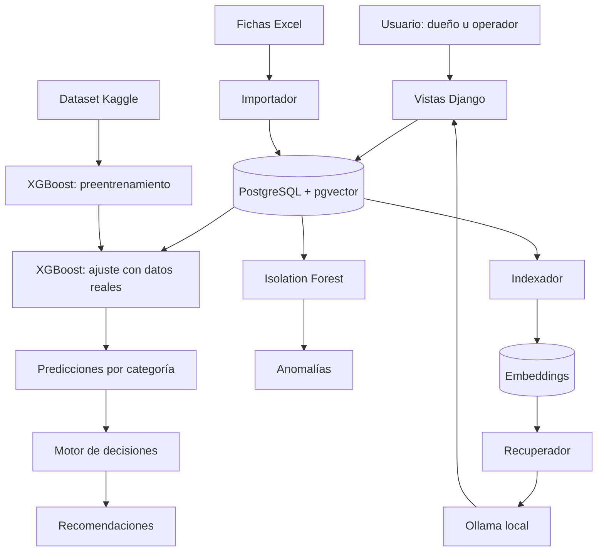

# Sistema de inventario con IA

Sistema web con inteligencia artificial para la gestión de inventario en una
microempresa del sector pintura en Lima. Desarrollado como sistema de tesis
de Ingeniería de Sistemas (diseño preexperimental, pretest/postest sobre el
mismo grupo). Este documento es la referencia técnica del proyecto: describe
la arquitectura, las decisiones de diseño, el modelo de datos y cómo
instalarlo y operarlo.

El sistema cubre: registro de inventario y pedidos, un motor de predicción
de demanda con transferencia de aprendizaje (preentrenamiento con un dataset
externo de Kaggle + ajuste con datos propios de la microempresa), un motor
de decisiones de reposición basado en esas predicciones, detección de
anomalías de control de existencias, y un asistente conversacional (RAG +
LLM local vía Ollama) sobre el estado del inventario.

## Estructura del sistema

```
SISTEMA DE INVENTARIO CON IA
│
├── INTERFAZ — Django Templates
│     ├── Bootstrap 5 + Bootstrap Icons → componentes e iconografía
│     ├── Chart.js → gráficos del dashboard
│     ├── Dashboard → EI, NS y COI con filtro por periodo y origen
│     ├── Operación diaria → pedidos, movimientos, conteos físicos
│     ├── Recomendaciones → reposición explicada, aceptar o rechazar
│     ├── Anomalías → diferencias y movimientos atípicos
│     └── Asistente → chat con fuentes auditables
│
├── BACKEND — Django 5.2 LTS
│     ├── Inventario → productos, stock, movimientos
│     ├── Pedidos → cantidad solicitada vs. atendida
│     ├── Conteos → stock de sistema vs. stock físico
│     ├── Costos → almacenamiento y mermas
│     ├── Indicadores → una sola función por indicador
│     ├── Importación → carga y validación de fichas Excel
│     └── Permisos → grupos administrador y operador
│
├── IA
│     ├── XGBoost → pronóstico de demanda con aprendizaje por transferencia
│     ├── Isolation Forest → detección de anomalías de inventario
│     ├── sentence-transformers → embeddings multilingües locales
│     ├── Ollama + qwen2.5:7b → redacción en lenguaje natural (local)
│     └── RAG → recuperación por similitud sobre datos del sistema
│
├── MOTOR DE DECISIONES (determinístico, no IA)
│     ├── Stock de seguridad
│     ├── Punto de reorden
│     └── Cantidad a pedir
│
└── DATOS
      ├── PostgreSQL 18 → fuente persistente única
      ├── pgvector → búsqueda vectorial para el RAG
      └── Dataset externo → Kaggle Store Item Demand (preentrenamiento)
```

## Decisiones de diseño y su justificación

| Decisión | Alternativa descartada | Razón |
|---|---|---|
| Django Templates | React como proyecto separado | El aporte de la tesis está en la IA; un frontend separado añade semanas sin afectar los indicadores |
| PostgreSQL | MongoDB | Transacciones e integridad referencial garantizan la consistencia del stock, del cual depende el EI |
| Pronóstico por categoría | Pronóstico por producto | Ningún producto superó 4 días con venta al mes; el mínimo viable es 15 |
| Aprendizaje por transferencia | Entrenar solo con datos propios | Un mes de histórico no basta; el modelo sin transferencia apenas iguala a la línea base |
| LLM local (Ollama) | API externa | Confidencialidad de los datos, sin costo y sin dependencia de conexión |
| Motor de decisiones con fórmulas | Decisión por IA | Resultados auditables y respaldados por literatura de gestión de inventario |
| Una función por indicador | Cálculos en cada vista | El dashboard, el importador y el asistente nunca pueden dar valores distintos |

## Arquitectura


```mermaid
flowchart TD
  U[Usuario: dueño u operador] --> V[Vistas Django]
  V --> BD[(PostgreSQL + pgvector)]
  X[Fichas Excel] --> IMP[Importador]
  IMP --> BD
  K[Dataset Kaggle] --> ML[XGBoost: preentrenamiento]
  BD --> ML2[XGBoost: ajuste con datos reales]
  ML --> ML2
  ML2 --> P[Predicciones por categoría]
  P --> DES[Motor de decisiones]
  DES --> REC[Recomendaciones]
  BD --> AN[Isolation Forest]
  AN --> ANO[Anomalías]
  BD --> IDX[Indexador]
  IDX --> VEC[(Embeddings)]
  VEC --> RAG[Recuperador]
  RAG --> LLM[Ollama local]
  LLM --> V
```

### Flujo de operación

1. El operador registra pedidos, movimientos y conteos.
2. El modelo pronostica la demanda de cada categoría apta.
3. El motor de decisiones calcula stock de seguridad, punto de reorden y cantidad a pedir.
4. El detector de anomalías revisa diferencias de inventario y movimientos atípicos.
5. El dashboard presenta los indicadores; el asistente responde consultas sobre los datos.

## Reglas del sistema

Estas reglas son parte del diseño. Cambiarlas altera la validez de los indicadores.

**Integridad del stock.** El stock se actualiza dentro de una transacción con bloqueo del registro. Una salida que deje el stock en negativo se rechaza. Editar o eliminar un movimiento revierte su efecto.

**Demanda real.** El pronóstico se entrena con la cantidad **solicitada**, no con la atendida. Entrenar con lo atendido haría que el modelo aprenda una demanda subestimada y perpetúe el desabastecimiento.

**Separación de orígenes.** Los datos de prueba nunca entran en los indicadores reportados ni en el entrenamiento del modelo vigente. El comando de entrenamiento usa `origen=real` por defecto y registra el origen empleado.

**El modelo de lenguaje no calcula.** Toda cifra que el asistente muestra proviene del contexto recuperado. Si el dato no está en el contexto, el asistente lo indica en lugar de estimarlo. Se verificó que la instrucción por sí sola no basta: lo que evita el cálculo es que el contexto contenga siempre el valor precalculado.

**Falla del servicio de IA.** Si el modelo de lenguaje no responde, el asistente muestra los datos recuperados sin redactar. El sistema no queda inutilizable.

**Anonimización.** Antes de enviar contexto al modelo de lenguaje se eliminan nombres de clientes, razón social, correos y teléfonos. Se mantiene aunque el modelo sea local, para que siga vigente si se cambia a un proveedor externo.

**Validación en la importación.** El importador verifica la coherencia entre las hojas de las fichas, detecta fechas inexistentes y reporta discrepancias antes de escribir. Todo se ejecuta en una transacción: si falla, no queda nada a medias.

## Stack

- Python + Django 5.2
- PostgreSQL con la extensión [pgvector](https://github.com/pgvector/pgvector)
  (necesaria para el índice del asistente conversacional)
- `pandas`, `numpy`, `scikit-learn`, `xgboost` (motor de predicción de demanda)
- `sentence-transformers` (embeddings del asistente conversacional)
- Ollama local (LLM del asistente conversacional; los datos de la
  microempresa no salen del equipo)
- Configuración vía `.env` con `python-decouple`

## Instalación

1. Crear y activar un entorno virtual, e instalar dependencias:

   ```bash
   python -m venv venv
   source venv/bin/activate
   pip install -r requirements.txt
   ```

2. Crear la base de datos en PostgreSQL con la extensión `pgvector`
   disponible en el servidor (`CREATE EXTENSION IF NOT EXISTS vector;` la
   ejecuta la migración `0013`, pero el paquete `pgvector` debe estar
   instalado en el servidor de PostgreSQL).

3. Copiar `.env.example` a `.env` y completar los valores (ver tabla de
   variables más abajo).

4. Aplicar las migraciones y crear los grupos de permisos:

   ```bash
   python manage.py migrate
   python manage.py crear_grupos_permisos
   python manage.py createsuperuser
   ```

5. Levantar el servidor:

   ```bash
   python manage.py runserver
   ```

6. (Opcional, asistente conversacional) Tener Ollama corriendo localmente
   con el modelo indicado en `LLM_MODELO` descargado (`ollama pull
   qwen2.5:7b`), y regenerar el índice con `indexar_conocimiento`.

## Variables de entorno

Definidas en `.env` (plantilla en `.env.example`); nunca se versiona `.env`
ni se ponen credenciales directamente en `core/settings.py`.

| Variable               | Descripción                                                                          | Valor por defecto / ejemplo         |
|------------------------|---------------------------------------------------------------------------------------|--------------------------------------|
| `SECRET_KEY`           | Clave secreta de Django.                                                              | `changeme-generate-a-new-django-secret-key` |
| `DEBUG`                | Modo debug de Django.                                                                 | `True`                               |
| `ALLOWED_HOSTS`        | Hosts permitidos, separados por coma.                                                 | `localhost,127.0.0.1`                |
| `DB_NAME`              | Nombre de la base de datos PostgreSQL.                                                | `inventario_ia`                      |
| `DB_USER`              | Usuario de PostgreSQL.                                                                | `diego`                              |
| `DB_PASSWORD`          | Contraseña de PostgreSQL.                                                             | *(vacío por defecto)*                |
| `DB_HOST`              | Host de PostgreSQL.                                                                   | `localhost`                          |
| `DB_PORT`              | Puerto de PostgreSQL.                                                                 | `5432`                               |
| `LLM_PROVEEDOR`        | Proveedor del modelo de lenguaje del asistente conversacional.                        | `ollama`                             |
| `LLM_MODELO`           | Modelo servido por el proveedor.                                                      | `qwen2.5:7b`                         |
| `LLM_URL`              | URL base de la API del proveedor (sin `/api/chat`).                                   | `http://localhost:11434`             |
| `EMPRESA_RAZON_SOCIAL` | Opcional: si se define, el anonimizador la redacta antes de enviarla al LLM.          | *(vacío)*                            |
| `PRONOSTICO_TOLERANCIA_RELATIVA` | Tolerancia del acierto del pronóstico: un día acierta si \|real − pronóstico\| / max(real, 1) ≤ este valor. Ver [Exactitud del pronóstico](#exactitud-del-pronóstico). | `0.20` |

## Comandos de gestión

Todos se ejecutan con `python manage.py <comando>`.

| Comando                 | Qué hace                                                                                                          | Parámetros                                                                 |
|--------------------------|---------------------------------------------------------------------------------------------------------------------|-------------------------------------------------------------------------------|
| `cargar_datos`           | Importa las fichas de registro (Excel, hojas `1_EI`, `2_NS`, `3_COI_CA`, `3_COI_PD`) a la base de datos.            | `--archivo` (obligatorio), `--origen prueba\|real` (obligatorio), `--limpiar`, `--dry-run` |
| `clasificar_productos`   | Clasifica productos por categoría según palabras clave en el nombre.                                                | `--codigo`, `--categoria` (ambos opcionales; sin ellos reclasifica todos)     |
| `configurar_lead_time`   | Asigna lead time (días) a productos.                                                                                 | `--dias` (obligatorio), `--codigo` (opcional; sin él, solo los que están en 0) |
| `crear_grupos_permisos`  | Crea/actualiza los grupos "administrador" (acceso total) y "operador" (pedidos, movimientos y conteos, sin borrar). | —                                                                              |
| `detectar_anomalias`     | Corre los detectores de anomalías de control de existencias y guarda registros `Anomalia`.                          | `--origen` (opcional)                                                         |
| `entrenar_base`          | Fase 1: preentrena el motor de predicción con el dataset externo de Kaggle.                                          | `--archivo` (por defecto `datos/train.csv`), `--dias-test` (30)               |
| `entrenar_ajustado`      | Fase 2: continúa el entrenamiento del modelo base con datos internos (transferencia) y compara contra línea base y modelo solo-interno. Falla si `--dias-test` dejaría menos de 14 días para entrenar. | `--origen prueba\|real` (por defecto `real`), `--dias-test` (30), `--nivel producto\|categoria` (por defecto `producto`) |
| `optimizar_modelo`       | Busca hiperparámetros del ajuste con validación cruzada temporal, prueba variantes de la fase base y de variables, y compara todo sobre el mismo test. **No activa ni registra ningún modelo**; guarda el reporte en `artefactos/optimizacion/` (JSON y CSV). Ver [Optimización del modelo de predicción](#optimización-del-modelo-de-predicción). | `--origen` (`real`), `--nivel` (`categoria`), `--dias-test` (7), `--pliegues` (4), `--iteraciones` (100), `--quitar` (3), `--semilla` (42), `--semillas-ruido` (10), `--archivo-externo` |
| `predecir_demanda`       | Genera predicciones de demanda diaria con el modelo ajustado activo (o el base si aún no hay ajustado).              | `--dias` (30), `--origen` (opcional)                                          |
| `evaluar_predicciones`   | Completa `demanda_real` en predicciones ya vencidas (solo con pedidos del origen y hasta el último día con pedidos de ese origen) y calcula MAE, RMSE, SMAPE y R². Además evalúa la exactitud del modelo ajustado vigente contra tres líneas base, en horizonte diario y de ventana de lead time, con validación de origen móvil (o la división única de antes con `--no-walk-forward`). **No activa ni registra ningún modelo**; guarda el reporte en `artefactos/evaluacion/` (y la división única diaria, también en el vigente). Ver [Exactitud del pronóstico](#exactitud-del-pronóstico). | `--origen` (`real`), `--horizonte diario\|ventana\|ambos` (`ambos`), `--walk-forward`/`--no-walk-forward` (activado) |
| `generar_recomendaciones`| Genera una `Recomendacion` de reposición por producto activo con predicciones disponibles.                           | `--nivel-servicio` (0.95), `--dias-cobertura` (30)                            |
| `indexar_conocimiento`   | Regenera el índice del asistente conversacional (borra y reconstruye `DocumentoIndexado`).                           | —                                                                              |
| `recalcular_stock`       | Recalcula `stock_actual` de todos los productos a partir del historial de `Movimiento`.                              | —                                                                              |

## Modelos de datos

Todos en el paquete `inventario/models/` (`operacion.py`, `costos.py`,
`ia.py`), registrados en `admin.py`. El campo
`origen` (`prueba`/`real`) presente en varios modelos permite separar y
limpiar los datos de prueba (pretest/postest) de los datos reales del
negocio.

| Modelo                | Campos principales                                                                                                           |
|------------------------|-------------------------------------------------------------------------------------------------------------------------------|
| `Producto`             | `codigo`, `nombre`, `presentacion`, `color`, `marca`, `categoria`, `precio_venta`, `costo_compra`, `stock_actual`, `stock_minimo`, `lead_time_dias`, `activo`, `origen` |
| `Proveedor`            | `nombre`, `contacto`, `telefono`, `lead_time_promedio`                                                                        |
| `Compra`               | `proveedor` (FK), `fecha_pedido`, `fecha_llegada`, `estado`                                                                   |
| `CompraDetalle`        | `compra` (FK), `producto` (FK), `cantidad_pedida`, `cantidad_recibida`, `costo_unitario`, `fecha_llegada_linea`               |
| `Movimiento`           | `producto` (FK), `tipo` (ingreso/salida/ajuste), `cantidad`, `fecha`, `documento`, `motivo`, `usuario` (FK), `stock_anterior`, `origen` |
| `Pedido`               | `fecha_solicitud`, `cliente`, `canal`, `estado`, `origen`                                                                     |
| `PedidoDetalle`        | `pedido` (FK), `producto` (FK), `cantidad_solicitada`, `cantidad_atendida`, `fecha_requerida`, `fecha_atencion`, `atendido_a_tiempo`, `motivo_no_atencion` |
| `ConteoFisico`         | `fecha_corte`, `responsable`, `observaciones`, `origen`                                                                       |
| `ConteoDetalle`        | `conteo` (FK), `producto` (FK), `stock_sistema`, `stock_fisico`, `diferencia` (calculado)                                     |
| `Merma`                | `producto` (FK), `cantidad`, `motivo`, `costo_unitario`, `fecha`, `origen`                                                    |
| `CostoAlmacenamiento`  | `periodo_mes`, `concepto`, `monto`, `origen`                                                                                  |
| `ModeloEntrenado`      | `fecha_entrenamiento`, `fase` (base/ajustado), `nivel` (producto/categoria), `algoritmo`, `hiperparametros`, `mae`, `rmse`, `smape`, `r2`, `mae_linea_base`, `mae_solo_interno`, `n_registros_externos`, `n_registros_internos`, `origen_datos_internos`, `dias_entrenamiento`, `dias_prueba`, `ruta_archivo`, `activo` |
| `Prediccion`           | `producto` (FK), `fecha_generacion`, `fecha_objetivo`, `demanda_predicha`, `demanda_real`, `modelo` (FK a `ModeloEntrenado`), `nivel_prediccion`, `participacion_usada` |
| `Recomendacion`        | `producto` (FK), `fecha_generacion`, `estado` (crítico/reponer/normal/exceso), `stock_actual_snapshot`, `demanda_predicha_periodo`, `desviacion_demanda`, `lead_time_usado`, `stock_seguridad`, `punto_reorden`, `cantidad_sugerida`, `nivel_servicio_objetivo`, `explicacion`, `aceptada`, `fecha_decision` |
| `Anomalia`             | `producto` (FK), `fecha_deteccion`, `tipo`, `severidad`, `score`, `valor_observado`, `valor_esperado`, `descripcion`, `revisada`, `fecha_revision` |
| `DocumentoIndexado`    | `tipo`, `referencia_id`, `contenido`, `embedding` (vector, 384 dim.), `fecha_indexacion`                                      |
| `ConsultaAsistente`    | `pregunta`, `respuesta`, `documentos_usados` (JSON), `fecha`, `usuario` (FK)                                                  |

Todos los montos monetarios (`precio_venta`, `costo_compra`,
`costo_unitario`, `monto`) son `DecimalField(max_digits=12,
decimal_places=2)`, nunca `FloatField`, para evitar errores de redondeo en
los cálculos de costos.

## Indicadores y trazabilidad con los objetivos de la investigación

| Objetivo específico | Indicador | Fórmula | Tablas que lo sostienen | Módulo |
|---|---|---|---|---|
| OE1 · Control de existencias | EI (exactitud del inventario) | (SRC / TR) × 100 | `Producto`, `Movimiento`, `ConteoFisico`, `ConteoDetalle`, `Anomalia` | Stock automático + detección de anomalías |
| OE2 · Análisis predictivo y atención de pedidos | NS (nivel de servicio) | (PAT / PT) × 100 | `Pedido`, `PedidoDetalle`, `ModeloEntrenado`, `Prediccion` | Pronóstico de demanda |
| OE3 · Automatización y costos | COI (costos operativos de inventario) | CA + PD | `CostoAlmacenamiento`, `PedidoDetalle`, `Recomendacion`, `CompraDetalle` | Motor de decisiones + dashboard |

Donde SRC es stock registrado correctamente, TR total de registros
revisados, PAT pedidos atendidos a tiempo, PT pedidos totales, CA costos de
almacenamiento y PD pérdidas por desabastecimiento.

- **EI** — `ConteoFisico` / `ConteoDetalle` (comparación `stock_sistema` vs
  `stock_fisico`; `diferencia = 0` ⇒ registro correcto).
- **NS** — `Pedido` / `PedidoDetalle.atendido_a_tiempo`.
- **COI** — suma de `CostoAlmacenamiento.monto` en el periodo (costos de
  almacenamiento) más, por cada `PedidoDetalle` no atendido por completo,
  `(cantidad no atendida) × (precio_venta − costo_compra)` del producto
  (pérdidas por desabastecimiento).

  **Las mermas ya están dentro de esa suma**: `cargar_datos` (hoja
  `3_COI_CA`) carga el monto agregado de "Mermas del periodo" como una fila
  más de `CostoAlmacenamiento` (concepto `"Mermas del periodo — ..."`), no
  como registros `Merma` uno por uno — el Excel de esa hoja no trae el
  desglose por producto/cantidad que el modelo `Merma` exige. El modelo
  `Merma` existe para si en el futuro se quiere registrar cada merma
  individualmente (producto, cantidad, motivo, fecha), pero **si
  `calcular_coi()` llegara a sumar también `Merma.cantidad × costo_unitario`
  al COI, el monto de mermas quedaría contado dos veces**: una vez como fila
  agregada de `CostoAlmacenamiento` y otra vez desglosada por `Merma`. Antes
  de instrumentar `Merma` en el cálculo, hay que dejar de cargar "Mermas del
  periodo" como fila de `CostoAlmacenamiento` (o restarla al construir el
  monto de almacenamiento), no simplemente sumar las dos fuentes.

## Optimización del modelo de predicción

Comando `optimizar_modelo` (`inventario/ml/optimizacion.py`). Se corrió el
01/10/2026 sobre los datos reales de agosto 2026, nivel categoría
(accesorio, esmalte, látex), con la misma división que el modelo vigente
(#5): **24 días de ajuste (01/08–24/08) y 7 de prueba (25/08–31/08)**, en
orden cronológico. Se puede repetir tal cual cuando haya más histórico
(`python manage.py optimizar_modelo`, ~2 minutos).

### Qué se probó

1. **Hiperparámetros de la fase de ajuste** — búsqueda aleatoria de 100
   candidatos (`ParameterSampler`, equivalente a `RandomizedSearchCV`) más la
   configuración actual, sobre `n_estimators`, `learning_rate`,
   `max_depth`, `min_child_weight`, `subsample`, `colsample_bytree` y
   `reg_lambda` (espacio en `ESPACIO_AJUSTE`). Se eligió por validación
   cruzada temporal (`TimeSeriesSplit`, 4 pliegues) **solo sobre los 24 días
   de ajuste**: pliegues que entrenan con 8, 12, 16 y 20 días y validan con
   los 4 días siguientes. Los pliegues se arman por fecha, no por fila, para
   que las tres categorías de un mismo día caigan siempre juntas.
2. **Fase base** — 8 combinaciones adicionales de árboles (150, 300, 600) y
   learning rate (0.02, 0.05, 0.1) en el preentrenamiento con Kaggle, cada
   una ajustada con los hiperparámetros de ajuste actuales.
3. **Variables**, cada alternativa por separado: (a) + rezago de 1 día y
   media móvil de 3 días; (b) + indicador de inicio y de fin de mes (5
   primeros / 5 últimos días); (c) − las 3 variables de menor importancia
   por ganancia en el modelo ajustado actual (`dia_mes`, `rezago_30`,
   `std_movil_30`). Como las variables deben ser idénticas entre
   preentrenamiento y ajuste, **cada variante reentrena también la fase
   base** con ese mismo conjunto.
4. **Combinada** — la mejor base y el mejor conjunto de variables *según la
   validación cruzada* (nunca según el test), con su propia búsqueda del
   ajuste.

Garantías de validez: el test no participa de ninguna elección (ni de la
búsqueda, ni de la elección de base/variables, ni del cálculo de
importancias); un test automatizado altera por completo la demanda de los
días de prueba y verifica que nada de lo elegido cambie
(`inventario/tests/test_optimizacion.py`). No se usa shuffle en ningún paso.

Columnas de la tabla: **R² CV** = R² fuera de pliegue de la validación
cruzada (días de ajuste); **MAE/RMSE/SMAPE/R²** = test a un paso (las
variables de cada día usan la demanda real de días anteriores, igual que
`entrenar_ajustado`); **R² rec.** = test pronosticado de forma recursiva
desde el 24/08, sin ver ninguna demanda real del periodo de prueba (así usa
el modelo `predecir_demanda`).

### Resultados (mismo test de 21 filas, ordenados por R²)

| # | Grupo | Configuración | R² CV | MAE | RMSE | SMAPE | R² | R² rec. |
|---|---|---|---:|---:|---:|---:|---:|---:|
| 1 | 2. Base | Base 300 árboles, lr 0.02 | 0.256 | 11.79 | 13.64 | 61.7% | **0.4258** | 0.4504 |
| 2 | 2. Base | Base 150 árboles, lr 0.05 | 0.256 | 12.04 | 13.72 | 62.1% | 0.4193 | 0.4440 |
| 3 | Referencia | Modelo base sin ajuste | 0.224 | 11.82 | 13.74 | 61.1% | 0.4175 | 0.4157 |
| 4 | 2. Base | Base 150 árboles, lr 0.1 | 0.246 | 12.00 | 13.77 | 62.2% | 0.4151 | 0.4482 |
| 5 | Referencia | **Configuración actual (vigente, #5)** | 0.255 | 11.89 | 13.93 | 61.0% | **0.4013** | 0.4542 |
| 6 | 2. Base | Base 150 árboles, lr 0.02 | 0.248 | 12.39 | 14.00 | 62.6% | 0.3950 | 0.4225 |
| 7 | 3. Variables | + inicio y fin de mes | 0.219 | 12.18 | 14.10 | 62.0% | 0.3865 | 0.4161 |
| 8 | 2. Base | Base 600 árboles, lr 0.05 | 0.255 | 11.97 | 14.11 | 60.6% | 0.3860 | 0.4321 |
| 9 | 3. Variables | − dia_mes, rezago_30, std_movil_30 | 0.247 | 11.94 | 14.15 | 61.8% | 0.3819 | 0.3630 |
| 10 | 2. Base | Base 600 árboles, lr 0.02 | 0.233 | 12.19 | 14.19 | 61.8% | 0.3785 | 0.4191 |
| 11 | 3. Variables | + rezago_1 y media_movil_3 | 0.194 | 12.19 | 14.26 | 62.4% | 0.3724 | 0.4017 |
| 12 | 2. Base | Base 300 árboles, lr 0.1 | 0.264 | 12.44 | 14.48 | 62.9% | 0.3530 | 0.3776 |
| 13 | Referencia | Solo datos internos (sin transferencia) | 0.065 | 11.76 | 14.69 | 60.2% | 0.3340 | 0.4775 |
| 14 | 2. Base | Base 600 árboles, lr 0.1 | 0.262 | 12.42 | 14.97 | 61.9% | 0.3083 | 0.3216 |
| 15 | 4. Combinada | Base 300/lr 0.1 + variables actuales + ajuste por CV | 0.336 | 12.13 | 15.92 | 60.9% | 0.2177 | 0.5865 |
| 16 | 1. Ajuste | Ajuste optimizado por CV | 0.323 | 14.51 | 17.70 | 67.5% | 0.0332 | 0.0985 |
| 17 | Referencia | Línea base ingenua (día anterior) | −0.452 | 14.90 | 18.06 | 88.9% | −0.0063 | 0.2096 |

Hiperparámetros elegidos por la validación cruzada:

- Ajuste optimizado (fila 16): `n_estimators=400, learning_rate=0.02,
  max_depth=8, min_child_weight=3, subsample=1.0, colsample_bytree=0.8,
  reg_lambda=10` (actual: `50, 0.01, 6, 1, 0.8, 0.8, 1`).
- Combinada (fila 15): base `300 árboles, lr 0.1`; ajuste
  `n_estimators=25, learning_rate=0.2, max_depth=2, min_child_weight=1,
  subsample=0.5, colsample_bytree=0.8, reg_lambda=0.5`.

**Ruido por semilla.** La configuración actual repetida con 10 semillas
(0–9; solo cambia el azar de `subsample`/`colsample_bytree` en ambas
fases): R² test **0.374 ± 0.019** (rango 0.340–0.398), R² rec. 0.417 ±
0.017, R² CV 0.236 ± 0.011. El 0.4013 reportado por el modelo vigente
(semilla 42) queda por encima de las 10 repeticiones.

### Interpretación

- **El techo de R² con una evaluación válida está en ~0.40.** La mejor fila
  (0.4258, base de 300 árboles con lr 0.02) supera a la vigente en 0.025,
  que es del orden de la variación por semilla (desv. 0.019, rango 0.058).
  Ninguna mejora es atribuible a la configuración.
- **Optimizar por validación cruzada empeoró el test.** La búsqueda del
  ajuste subió el R² CV de 0.255 a 0.323, pero en test cayó a 0.033; la
  combinada, a 0.218. Entre las 14 configuraciones candidatas, el orden por
  R² CV y por R² test no se corresponde (Spearman −0.37, p = 0.19): con
  pliegues de validación de 4 días × 3 categorías (12 filas), la búsqueda
  se ajusta al ruido de esos días. Elegir en cambio la fila de mayor R² en
  test sería ajustar al test.
- **Ninguna variante de variables mejora**: ni el rezago de 1 día ni el
  inicio/fin de mes aportan, y quitar las de menor importancia tampoco.
- **La transferencia sigue aportando frente a entrenar solo con datos
  internos** en la validación cruzada (0.255 vs. 0.065) y en el test a un
  paso (0.401 vs. 0.334), aunque no en el recursivo (0.454 vs. 0.478),
  cuya diferencia también cae dentro del ruido. El ajuste con 24 días casi
  no mueve al modelo base (0.401 vs. 0.418 en test; 0.255 vs. 0.224 en CV).
- **Recomendación** (el comando no activa nada; la decisión es del
  autor): mantener la configuración actual. Con un mes de histórico, lo
  que limita el R² son los datos, no los hiperparámetros. Volver a correr
  `optimizar_modelo` cuando haya al menos 90 días; con más días de
  validación, la búsqueda por CV deja de ajustarse al ruido.

## Exactitud del pronóstico

Comando `evaluar_predicciones` (funciones en `inventario/ml/evaluacion.py`).
MAE, RMSE, SMAPE y R² no permiten afirmar nada sobre *exactitud* en el
sentido que se usa en logística, así que se agregan las métricas estándar
de gestión de inventario y tres líneas base contra las cuales compararlas.
Las definiciones, la tolerancia, el horizonte y los orígenes se fijaron
**antes** de correr la evaluación y no se ajustaron después de ver el
resultado. Por defecto la evaluación es de origen móvil y en dos horizontes
(diario y ventana de lead time); `--no-walk-forward` vuelve a la división
única para reproducir el resultado anterior.

### Métricas

| Métrica | Fórmula | Qué mide |
|---|---|---|
| **WAPE** | Σ \|real − pronóstico\| / Σ real | Tamaño del error relativo al volumen vendido. |
| **Exactitud** | 1 − WAPE | Lo mismo, expresado como acierto. Puede ser negativa (el error supera a la demanda, típico en baja rotación) y se reporta así, sin truncar a 0. |
| **Acierto dentro de tolerancia** | % de filas (días o ventanas) con \|real − pronóstico\| / max(real, 1) ≤ t | Con qué frecuencia el pronóstico cae dentro del margen aceptable. El max(real, 1) evita dividir por cero cuando no hubo demanda. |
| **R² intra-categoría** | R² calculado dentro de cada categoría por separado | Cuánto del movimiento de cada categoría (de día a día, o de ventana a ventana) explica el pronóstico. |
| **Dispersión entre orígenes** | Desviación estándar muestral del WAPE total de cada origen (uno por origen, no por fila) | Cuánto depende el resultado de qué semana se evalúa: 30% ± 4 no es lo mismo que 30% ± 18. |
| **R² global** | R² sobre todas las filas juntas (el que ya se reportaba) | Incluye la diferencia de nivel entre categorías (esmalte ~65 u/día, látex ~10, accesorios ~7): esa varianza entre categorías domina y lo infla. Se mantiene para no romper lo ya reportado. |

- El WAPE **total** es el WAPE agregado sobre todas las filas (Σ \|error\| /
  Σ real), no el promedio de los WAPE por categoría.
- Si una categoría no tuvo demanda en el periodo (Σ real = 0), su WAPE no
  está definido: se reporta como "—" y no entra en el WAPE total. Ninguna
  categoría se excluye por tener baja rotación.
- Sin varianza en la demanda real (o con menos de dos días) el R² tampoco
  está definido y se reporta como "—".

**R² y exactitud miden cosas distintas.** El R² mide cuánto del
movimiento día a día se explica; el WAPE mide el tamaño del error relativo
al volumen. Un pronóstico plano puede tener R² ≈ 0 y aun así un WAPE bajo
si el nivel es correcto, y uno que sigue bien las subidas y bajadas puede
tener un WAPE alto si está desplazado. Para dimensionar pedidos el WAPE es
el más relevante (lo que importa es cuántas unidades sobran o faltan), pero
ninguno reemplaza al otro: se reportan los dos.

### Tolerancia

- **Relativa: t = 0.20** (`PRONOSTICO_TOLERANCIA_RELATIVA` en `.env`). Es la
  misma regla del 20% que el sistema ya usa como diferencia tolerable entre
  stock de sistema y stock físico (detección de anomalías,
  `UMBRAL_DIFERENCIA_RELATIVA`): un solo criterio de negocio para "diferencia
  aceptable" en todo el sistema.
- **Absoluta (en unidades): no se fijó.** No hay compras ni lotes de
  proveedor registrados (`CompraDetalle` vacío), así que no hay un tamaño de
  lote de compra en el cual anclarla. Se evaluó anclarla al stock de
  seguridad que ya calcula el motor de decisiones (SS = z·σ·√L, la cantidad
  que el negocio guarda justamente para absorber el error del pronóstico),
  pero no tiene una traducción directa a un error diario por categoría. El
  SS se calcula por producto y cubre los L = 7 días de lead time, no un día.
  Sumado por categoría (lote vigente de recomendaciones, nivel de servicio
  95%) da ≈150 u (accesorio), ≈804 u (esmalte) y ≈584 u (látex) frente a
  una demanda diaria de ~7, ~65 y ~10 u, así que cualquier pronóstico
  "acertaría". Pasarlo a una tolerancia diaria por categoría (dividir por
  √L, o recalcular σ sobre la serie de la categoría en vez de sumar los σ de
  cada producto) obliga a elegir una conversión, lo que equivale a elegir la
  tolerancia. Se omite hasta que haya lotes de compra reales, o hasta que se
  defina una conversión del SS antes de mirar resultados.

### Horizonte: la ventana de lead time

El pronóstico alimenta el punto de reorden, ROP = d̄·L + SS: lo que el motor
necesita saber es cuánta demanda habrá **durante los L días** que tarda en
llegar el pedido, no cuánto se vende un martes concreto. Por eso se evalúan
dos horizontes por separado:

- **Diario (H = 1):** cada día por separado, como antes. Se mantiene para
  comparar.
- **Ventana de lead time (H = L):** se suma la demanda pronosticada de los L
  días y se compara contra la suma real de esos mismos días. Es el horizonte
  que importa para la decisión. Dentro de una ventana, un día sobrestimado y
  otro subestimado se compensan, igual que en el stock real durante el lead
  time.

L se lee del sistema y no se escribe a mano. Es la **mediana, redondeada
hacia arriba, del lead time que usa el motor de decisiones para el stock de
seguridad** (`lead_time_producto` en `inventario/decisiones/motor.py`): el
promedio real de las compras recibidas si hay al menos 3, y si no, el
`lead_time_dias` de la ficha. Se toman los productos activos de las
categorías evaluadas. Con los datos actuales no hay compras registradas, así
que sale de la ficha: 255 productos con 7 días y 1 con 10, **L = 7**. Se
redondea hacia arriba para que la ventana cubra el lead time completo.

### Validación de origen móvil (walk-forward)

Con 31 días de histórico, una única división (ajuste 01–24/08, prueba
25–31/08: 21 filas) depende de qué semana cayó en la prueba. Diferencias de
1 o 2 puntos de WAPE no son concluyentes. La evaluación sobre un origen de
pronóstico móvil es el método estándar para series cortas (Tashman, L. J.
(2000), "Out-of-sample tests of forecasting accuracy: an analysis and
review", *International Journal of Forecasting*, 16(4), 437–450; Hyndman,
R. J. & Athanasopoulos, G., *Forecasting: Principles and Practice*, 3.ª
ed., sección 5.10 "Time series cross-validation", evaluación sobre un
origen de pronóstico móvil). Para cada origen t
(`inventario/ml/walk_forward.py`):

1. Se rehace el ajuste fino usando **solo los días 1..t**, con la
   configuración del modelo vigente (#5) y sobre el modelo base
   preentrenado con Kaggle. La base no se vuelve a entrenar.
2. Se pronostican los días t+1..t+H **encadenando**: cada día pronosticado
   (con piso en 0) alimenta los rezagos y medias móviles del siguiente,
   como hace `predecir_demanda`. Nunca se usa la demanda real de los días
   intermedios.
3. Se compara contra la demanda real de esos días y se avanza t un día.

El primer origen es el que deja `MIN_DIAS_ENTRENAMIENTO` = 14 días de
ajuste (14/08). El último es el t con t+H = último día con datos. Con 31
días quedan **17 orígenes en el horizonte diario** (14/08–30/08) y **11 en
el de ventana** (14/08–24/08). Se parte por fecha: las tres categorías de
un día van siempre juntas. Con menos de 5 orígenes el comando advierte que
la métrica sigue siendo frágil. Sin ningún origen posible, falla con un
mensaje en vez de dar un número.

Hay dos garantías verificadas por tests (`inventario/tests/test_evaluacion.py`):

- ningún día pronosticado entra en el ajuste de su origen;
- poner 10.000 unidades en todos los días posteriores al origen, o alterar
  un día intermedio de la ventana, no cambia ningún pronóstico de ese
  origen.

Al plantar una fuga a propósito, esos tests fallan.

Las ventanas de orígenes consecutivos comparten 6 de sus 7 días, así que
las 11 ventanas no son 11 muestras independientes. La dispersión entre
orígenes describe cuánto cambia el resultado según la semana; no es un
intervalo de confianza.

### Líneas base

Las tres se evalúan con el mismo procedimiento (mismos orígenes, mismo
horizonte y mismas métricas que el modelo) y solo con la demanda real hasta
el origen:

1. **Media por categoría** de los días de ajuste de ese origen, repetida en
   todo el horizonte. Es la referencia natural del R² intra-categoría.
2. **Media móvil de 7 días** por categoría, encadenada: el primer día usa
   los 7 días reales anteriores al origen; los siguientes incluyen sus
   propios pronósticos en vez de la demanda real.
3. **Último valor** (persistencia): la demanda del día del origen,
   repetida.

El modelo solo puede presentarse como aportando valor si supera a las tres
en WAPE en el **horizonte de ventana**, que es el que importa para la
decisión.

### Resultados con validación de origen móvil

Corrida del 02/10/2026
(`artefactos/evaluacion/evaluacion_walkforward_20261002_060705.json`):
configuración del modelo vigente #5 (ajuste `n_estimators=50,
learning_rate=0.01, max_depth=6, subsample=0.8, colsample_bytree=0.8`)
sobre el modelo base #1, datos reales de agosto 2026, nivel categoría. Las
categorías base, solvente y temple no tienen pronóstico del modelo (menos
de 15 días con venta; se gestionan solo con punto de reorden), así que no
entran en la evaluación. "Filas" = orígenes × categorías. En las filas
**Total**, la columna R² es el R² global; en las demás, el intra-categoría.

**Horizonte diario (H = 1): 17 orígenes, 51 días-categoría.**

| Método | Categoría | Filas | Real | Pronosticado | MAE | RMSE | WAPE | Exactitud | Acierto ±20% | R² | Desv. WAPE entre orígenes |
|---|---|---:|---:|---:|---:|---:|---:|---:|---:|---:|---:|
| **Modelo vigente** | accesorio | 17 | 121 | 208.5 | 7.93 | 9.54 | 111.4% | −11.4% | 17.6% | −0.378 | ±24.5 pp |
|  | esmalte | 17 | 666 | 695.7 | 18.94 | 22.33 | 48.3% | 51.7% | 17.6% | −0.124 | ±39.4 pp |
|  | látex | 17 | 581 | 486.0 | 13.53 | 16.29 | 39.6% | 60.4% | 17.6% | −0.174 | ±13.9 pp |
| | **Total** (R² global) | 51 | 1368 | 1390.2 | 13.46 | 16.88 | **50.2%** | **49.8%** | 17.6% | 0.357 | ±16.5 pp |
| Media por categoría (entrenamiento) | accesorio | 17 | 121 | 146.4 | 7.24 | 8.52 | 101.7% | −1.7% | 23.5% | −0.100 | ±30.0 pp |
|  | esmalte | 17 | 666 | 685.7 | 17.64 | 21.67 | 45.0% | 55.0% | 29.4% | −0.058 | ±39.1 pp |
|  | látex | 17 | 581 | 430.0 | 14.04 | 17.69 | 41.1% | 58.9% | 29.4% | −0.384 | ±17.7 pp |
| | **Total** (R² global) | 51 | 1368 | 1262.1 | 12.98 | 16.88 | **48.4%** | **51.6%** | 27.5% | 0.358 | ±22.5 pp |
| Media móvil 7 días | accesorio | 17 | 121 | 93.0 | 6.94 | 9.04 | 97.5% | 2.5% | 11.8% | −0.238 | ±29.1 pp |
|  | esmalte | 17 | 666 | 687.7 | 18.76 | 22.10 | 47.9% | 52.1% | 5.9% | −0.100 | ±34.5 pp |
|  | látex | 17 | 581 | 516.1 | 13.11 | 16.60 | 38.4% | 61.6% | 35.3% | −0.219 | ±20.4 pp |
| | **Total** (R² global) | 51 | 1368 | 1296.9 | 12.94 | 16.79 | **48.2%** | **51.8%** | 17.6% | 0.365 | ±20.9 pp |
| Último valor (día anterior) | accesorio | 17 | 121 | 111.0 | 10.35 | 13.19 | 145.5% | −45.5% | 23.5% | −1.637 | ±63.9 pp |
|  | esmalte | 17 | 666 | 708.0 | 24.94 | 30.68 | 63.7% | 36.3% | 17.6% | −1.122 | ±62.1 pp |
|  | látex | 17 | 581 | 566.0 | 17.35 | 21.57 | 50.8% | 49.2% | 17.6% | −1.059 | ±48.7 pp |
| | **Total** (R² global) | 51 | 1368 | 1385.0 | 17.55 | 22.96 | **65.4%** | **34.6%** | 19.6% | −0.188 | ±35.3 pp |

| Método | WAPE medio por origen | Desv. | Mín. | Máx. | Orígenes |
|---|---:|---:|---:|---:|---:|
| **Modelo vigente** | 51.2% | ±16.5 pp | 20.3% | 80.0% | 17 |
| Media por categoría (entrenamiento) | 49.7% | ±22.5 pp | 25.5% | 112.4% | 17 |
| Media móvil 7 días | 49.8% | ±20.9 pp | 20.5% | 106.2% | 17 |
| Último valor (día anterior) | 69.9% | ±35.3 pp | 22.4% | 158.3% | 17 |

**Horizonte ventana de lead time (H = 7, suma de la ventana): 11 orígenes,
33 ventanas-categoría.**

| Método | Categoría | Filas | Real | Pronosticado | MAE | RMSE | WAPE | Exactitud | Acierto ±20% | R² | Desv. WAPE entre orígenes |
|---|---|---:|---:|---:|---:|---:|---:|---:|---:|---:|---:|
| **Modelo vigente** | accesorio | 11 | 589 | 977.8 | 35.34 | 38.13 | 66.0% | 34.0% | 0.0% | −13.122 | ±50.0 pp |
|  | esmalte | 11 | 2933 | 3094.9 | 31.41 | 39.10 | 11.8% | 88.2% | 81.8% | −0.932 | ±8.4 pp |
|  | látex | 11 | 2523 | 2066.6 | 46.49 | 50.17 | 20.3% | 79.7% | 45.5% | −5.229 | ±7.2 pp |
| | **Total** (R² global) | 33 | 6045 | 6139.3 | 37.75 | 42.82 | **20.6%** | **79.4%** | 42.4% | 0.798 | ±4.6 pp |
| Media por categoría (entrenamiento) | accesorio | 11 | 589 | 675.1 | 12.98 | 15.90 | 24.2% | 75.8% | 54.5% | −1.454 | ±27.3 pp |
|  | esmalte | 11 | 2933 | 3121.5 | 32.32 | 38.87 | 12.1% | 87.9% | 81.8% | −0.909 | ±7.5 pp |
|  | látex | 11 | 2523 | 1868.2 | 59.52 | 62.16 | 26.0% | 74.0% | 9.1% | −8.563 | ±6.7 pp |
| | **Total** (R² global) | 33 | 6045 | 5664.8 | 34.94 | 43.31 | **19.1%** | **80.9%** | 48.5% | 0.793 | ±4.0 pp |
| Media móvil 7 días | accesorio | 11 | 589 | 347.1 | 31.00 | 34.84 | 57.9% | 42.1% | 0.0% | −10.788 | ±23.4 pp |
|  | esmalte | 11 | 2933 | 3236.5 | 56.80 | 64.06 | 21.3% | 78.7% | 54.5% | −4.186 | ±11.3 pp |
|  | látex | 11 | 2523 | 2218.3 | 37.48 | 45.05 | 16.3% | 83.7% | 63.6% | −4.023 | ±11.3 pp |
| | **Total** (R² global) | 33 | 6045 | 5801.9 | 41.76 | 49.49 | **22.8%** | **77.2%** | 39.4% | 0.730 | ±7.6 pp |
| Último valor (día anterior) | accesorio | 11 | 589 | 476.0 | 57.73 | 60.56 | 107.8% | −7.8% | 0.0% | −34.616 | ±45.8 pp |
|  | esmalte | 11 | 2933 | 3402.0 | 122.27 | 162.72 | 45.9% | 54.1% | 27.3% | −32.462 | ±41.5 pp |
|  | látex | 11 | 2523 | 2429.0 | 96.73 | 119.15 | 42.2% | 57.8% | 27.3% | −34.136 | ±31.9 pp |
| | **Total** (R² global) | 33 | 6045 | 6307.0 | 92.24 | 121.58 | **50.4%** | **49.6%** | 18.2% | −0.630 | ±27.3 pp |

| Método | WAPE medio por origen | Desv. | Mín. | Máx. | Orígenes |
|---|---:|---:|---:|---:|---:|
| **Modelo vigente** | 20.6% | ±4.6 pp | 13.8% | 26.7% | 11 |
| Media por categoría (entrenamiento) | 19.0% | ±4.0 pp | 14.8% | 26.0% | 11 |
| Media móvil 7 días | 22.9% | ±7.6 pp | 10.3% | 38.4% | 11 |
| Último valor (día anterior) | 50.9% | ±27.3 pp | 18.8% | 98.4% | 11 |

### Interpretación

- **En el horizonte de ventana, el que importa para la decisión, el modelo
  no supera a las tres líneas base.** Supera a la media móvil de 7 días
  (20.6% vs. 22.8% de WAPE) y al último valor (50.4%), pero **no a la media
  por categoría de los días de ajuste** (19.1%). Por la regla fijada de
  antemano, el modelo no puede presentarse como aportando valor frente a
  predecir el promedio de cada categoría. La diferencia con la media (1.5
  puntos) es menor que la dispersión entre orígenes de ambos (±4.6 y ±4.0
  pp), así que tampoco hay evidencia de que sea peor: con este histórico
  son indistinguibles.
- **Por categoría, la desventaja viene de accesorio.** El modelo
  pronostica 978 unidades contra 589 reales en esas ventanas (WAPE 66.0%
  vs. 24.2% de la media). En esmalte empatan (11.8% vs. 12.1%), y en látex
  el modelo es mejor que la media (20.3% vs. 26.0%) aunque no que la media
  móvil (16.3%).
- **El error de la ventana es mucho menor que el diario.** WAPE de 20.6%
  (exactitud 79.4%) frente a 50.2% por día: los errores diarios se
  compensan dentro de la semana. Para dimensionar el punto de reorden, el
  número relevante es el de la ventana.
- **El resultado de la ventana es más estable entre orígenes:** ±4.6 pp
  para el modelo, frente a ±16.5 pp en el horizonte diario.
- **En el horizonte diario el modelo tampoco supera a las medias** (50.2%
  vs. 48.2% la media móvil y 48.4% la media por categoría), lo mismo que
  con la división única. La dispersión diaria (±16.5 a ±22.5 pp) es mucho
  mayor que esas diferencias.
- **El R² intra-categoría de la ventana no es informativo aquí.** Las
  ventanas de orígenes consecutivos comparten 6 de 7 días, así que dentro
  de una categoría sus sumas casi no varían. Cualquier sesgo de nivel
  domina y el R² sale muy negativo para todos los métodos. El R² global de
  0.80 vuelve a reflejar sobre todo la diferencia de nivel entre
  categorías.
- Esto justifica reentrenar y volver a correr `evaluar_predicciones` cuando
  haya más histórico. No se modificó nada para que el modelo supere a las
  líneas base.

### Resultado anterior con la división única

Corrida del 02/10/2026 con `--no-walk-forward`
(`artefactos/evaluacion/evaluacion_categoria_20261002_054829.json`): modelo
vigente #5, 24 días de ajuste (01/08–24/08) y 7 de prueba (25/08–31/08), 21
filas, pronóstico diario a un paso (variables con la demanda real hasta el
día anterior). La opción `--no-walk-forward --horizonte diario` lo
reproduce y es la única corrida que se guarda en los campos de evaluación
de `ModeloEntrenado`.

| | MAE | RMSE | WAPE | Exactitud | Acierto ±20% | R² global | Exact. accesorio | Exact. esmalte | Exact. látex | R² intra accesorio | R² intra esmalte | R² intra látex |
|---|---:|---:|---:|---:|---:|---:|---:|---:|---:|---:|---:|---:|
| **Modelo vigente** | 11.89 | 13.93 | 45.6% | 54.4% | 19.0% | 0.4013 | −5.7% | 49.9% | 70.9% | −0.2777 | −0.3752 | −0.1374 |
| Media por categoría (entrenamiento) | 11.63 | 14.21 | 44.6% | 55.4% | 33.3% | 0.3769 | 14.0% | 54.1% | 65.2% | −0.0138 | −0.1465 | −0.8247 |
| Media móvil 7 días | 11.37 | 13.42 | **43.6%** | **56.4%** | 23.8% | **0.4447** | 0.3% | 53.2% | 70.9% | −0.2975 | −0.1511 | −0.2041 |
| Último valor (día anterior) | 14.90 | 18.06 | 57.1% | 42.9% | 14.3% | −0.0063 | −71.7% | 57.8% | 52.7% | −2.2268 | −0.6228 | −1.4978 |

Con 21 filas el modelo no superaba a la media móvil ni a la media por
categoría. El R² global de 0.40 se explicaba por la diferencia de nivel
entre categorías: dentro de cada una el R² era negativo.

## Limitaciones

- El histórico disponible es de 31 días; la literatura recomienda al menos 90 para series temporales.
- Con solo 31 días, el conjunto de prueba no puede ser grande sin dejar muy
  pocos días para entrenar: el modelo ajustado vigente usa `--dias-test 7`
  (24 días de entrenamiento, 7 de prueba). El propio comando
  `entrenar_ajustado` rechaza una combinación que deje menos de 14 días de
  entrenamiento (`MIN_DIAS_ENTRENAMIENTO`), así que un `--dias-test` mayor
  simplemente no corre con este histórico. Con tan pocos días en cualquiera
  de los dos conjuntos, las métricas van a variar bastante entre
  entrenamientos sucesivos. Medido: con solo cambiar la semilla, el R² en
  test de la configuración vigente varía entre 0.340 y 0.398 (ver
  [Optimización del modelo de predicción](#optimización-del-modelo-de-predicción)).
- El pronóstico por categoría no captura diferencias finas entre productos de una misma categoría.
- Tres categorías quedan fuera del modelo por volumen insuficiente.
- El detector de movimientos atípicos requiere al menos cinco movimientos previos por producto.
- El modelo de lenguaje local puede producir redacciones imperfectas; las cifras siempre provienen del sistema.
